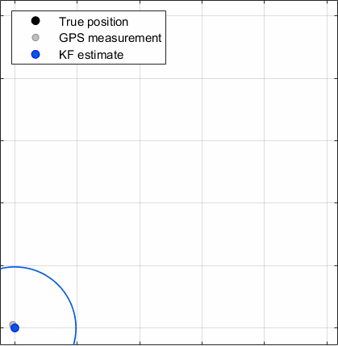

# KF-2D-Ground-Vehicle-Tracking

Linear Kalman Filter simulation for tracking a ground vehicle in 2D using noisy GPS-like position measurements.

## Problem Definition

A vehicle moves on a 2D plane with state:

- `[x, y, vx, vy]`

Measurements provide position only:

- `[x, y] + noise`

The estimator uses a constant-velocity linear model to recover both position and velocity from noisy measurements.

## Approach Summary

- Simulate a realistic trajectory with maneuver segments (acceleration and turning)
- Generate noisy position measurements
- Run a modular linear Kalman Filter with:
  - state prediction
  - covariance prediction
  - Kalman gain computation
  - measurement update
  - Joseph-form covariance update
- Compare true trajectory, measurements, and KF estimate
- Evaluate tuning effects of process noise (`Q`) and measurement noise (`R`)
- Quantify behavior under model mismatch (maneuvering truth vs. CV filter model)

## Repository Layout

- `src/` MATLAB implementation (simulation, KF core, plotting, tuning study, animation)
- `docs/` Engineering notes and analysis
- `results/` Output plots and exported GIF

## Key Features

- Clean modular MATLAB functions
- Baseline tracking study and tuning comparison
- Error plots with 3-sigma envelopes
- Covariance evolution diagnostics
- Optional 2D uncertainty ellipse visualization
- Stepwise tracking animation with GIF export for GitHub embedding

## Tuning Strategy

The tuning study compares six scenario sets by changing process-noise acceleration levels and measurement noise standard deviation.

| Scenario | qAccel [qx, qy] | rStd [m] | R diag [m^2] | Maneuvers in Truth | Intent |
|---|---:|---:|---:|---|---|
| baseline | [0.8, 0.8] | 3.0 | [9.0, 9.0] | Yes | Reference case |
| low_process_noise | [0.08, 0.08] | 3.0 | [9.0, 9.0] | Yes | More model trust, smoother output |
| high_process_noise | [4.0, 4.0] | 3.0 | [9.0, 9.0] | Yes | More responsiveness, less smoothing |
| low_measurement_noise | [0.8, 0.8] | 1.2 | [1.44, 1.44] | Yes | More measurement trust |
| high_measurement_noise | [0.8, 0.8] | 8.0 | [64.0, 64.0] | Yes | More model trust |
| no_model_mismatch | [0.8, 0.8] | 3.0 | [9.0, 9.0] | No | Idealized reference |

## Quick Start

1. Open MATLAB in the repository root.
2. Add source folder to path:
   - `addpath("src")`
3. Run:
   - `main`

Generated outputs are saved in `results/`.

## Tracking Demo

The animation shows true vehicle motion, noisy GPS-like measurements, and Kalman Filter state estimates evolving step-by-step. Optional covariance ellipses visualize estimated position uncertainty over time.

## Example Output Visuals

After running `main`, expected artifacts include:

- `results/tracking_overview.png`
- `results/estimation_errors.png`
- `results/covariance_evolution.png`
- `results/uncertainty_ellipses.png`
- `results/tracking_demo.gif`
- `results/tuning_study/tuning_error_comparison.png`
- `results/tuning_study/tuning_rmse_summary.png`

## Engineering Notes

See:

- `docs/system_model.md`
- `docs/tuning_analysis.md`
- `docs/limitations.md`
- `docs/animation_pipeline.md`

This project is intentionally structured as a foundation for future estimator extensions such as EKF, UKF, and particle filters.

## License

This project is licensed under the MIT License.
